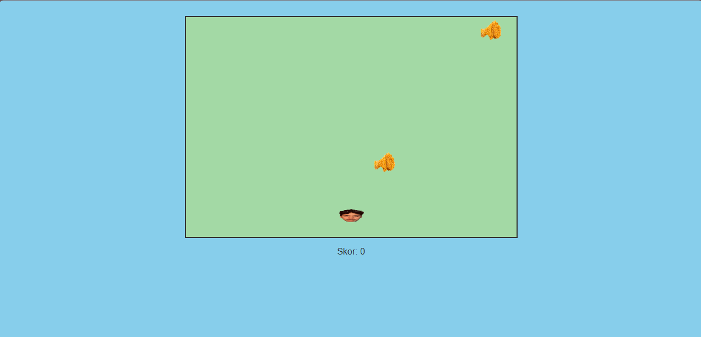

# 🐔 CATCH THE CHICKEN GAME

A simple and fun web game where users try to catch a moving chicken on the screen.

This project was created as a small JavaScript experiment to explore interactive UI and DOM manipulation.

---

## 🎮 Features

- Moving chicken animation
- Interactive click detection
- Simple game mechanics
- Fun UI

---

## 🛠 Tech Stack

- HTML
- CSS
- JavaScript

---

## 🚀 Live Demo

https://agusadhitama.github.io/catch-the-chicken-game/

---

## 📸 Preview

---

## 👨‍💻 Author

Agus Satria Adhitama  
IT Support • Web Developer
